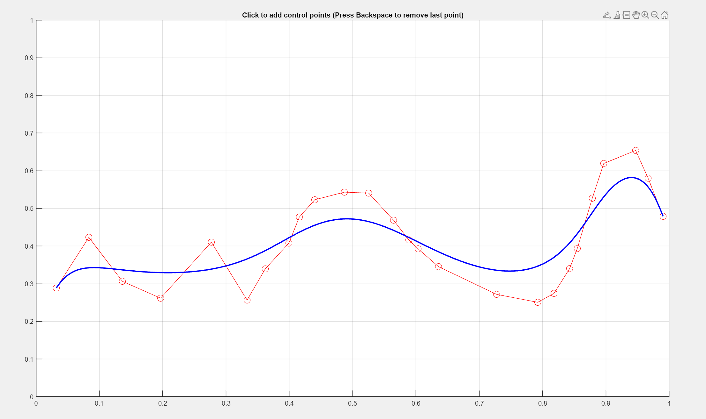

# Bezier-Curve
- Bézier Curve Visualization Using Lagrange Interpolation
- Bézier Curve Visualization Using De Casteljau's Algorithm

### ***If you want to know the maths behind it go [here](https://github.com/Kraken57/Bezier-Curve/blob/main/public/maths.pdf).***

## Plots

### Plot using Lagrange Interpolation

### Plot using De Casteljau's Algorithm

**As you can se the second graph is much smoother and clean**
